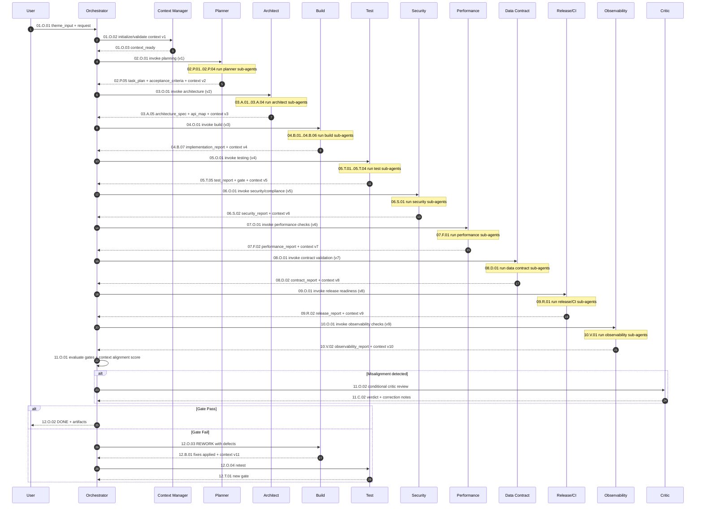
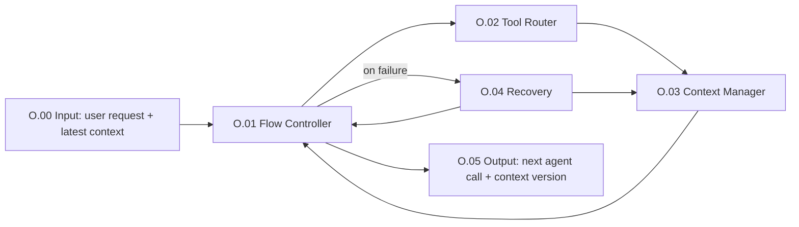
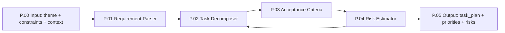
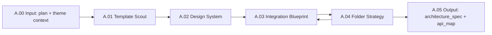
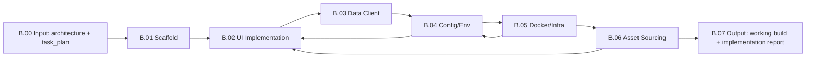
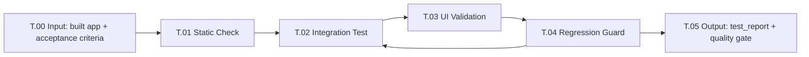
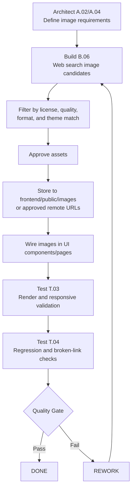
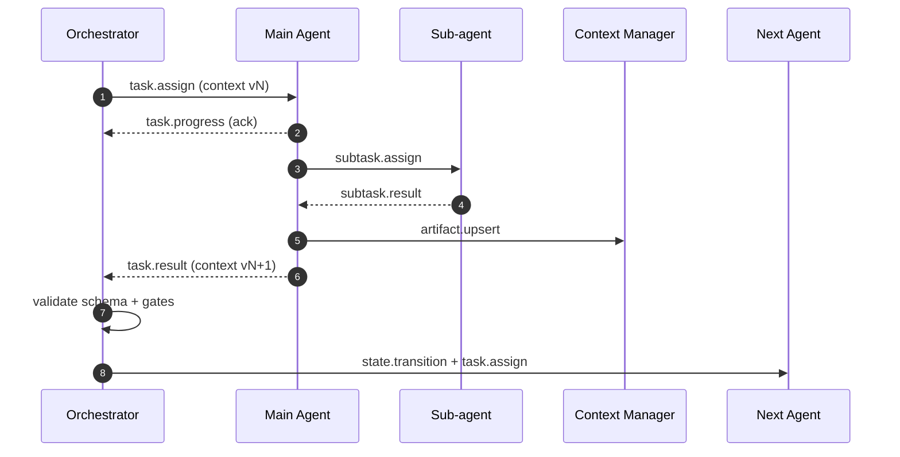

# Multi-Model Agentic Workflow for Theme-Driven Next.js Frontend

## Phase-1/2/3 starter (ravgentic)

This repository now includes a starter orchestrator that:

- accepts user theme input from terminal,
- creates initial planning artifacts,
- runs Planner + Architect component outputs,
- maps frontend routes to mock-backend endpoints,
- keeps `no-image-generation` policy by default.

Phase-3 foundation now also includes:

- `frontend/` Next.js scaffold files (app router structure),
- route pages for `/`, `/dashboard`, `/settings`, `/profile`,
- centralized API contract + endpoint mapping + fetch client stubs.

Run (canonical full workflow):

```bash
python3 src/orchestrator/main.py
```

This command now executes the connected main-agent workflow in README order:
`O -> P -> A -> B -> T -> S -> F -> D -> R -> V -> (conditional C)`.
At start, user provides a desired UI themed prompt. A first-stage prompt refinement
sub-agent runs before orchestration (`O.prompt_refiner`).
You can set reference sample path (e.g. mystic-flake in m2r2) via `.env`:

```env
REFERENCE_TEMPLATE_PATH=/absolute/path/to/m2r2/mystic-flake
REFERENCE_MODE=inspiration_only
COPY_MODE=forbidden
```

OpenAI prompt refinement connection (first stage):

```env
OPENAI_API_KEY=your_openai_api_key
OPENAI_MODEL=gpt-5.1
```

Notes:
- If `OPENAI_API_KEY` is set, `O.prompt_refiner` calls OpenAI chat completions.
- If key is missing or call fails, workflow falls back to local deterministic refinement.

It also records deterministic workflow outcomes in `orchestrator_run_log.json` with:
- `final_state`: `DONE | REWORK`
- `reason_codes`: gate-based failure codes when rework is needed.
- automatic rework loop for mandatory gate failures:
  `B -> T -> S -> F -> D -> R -> V` (bounded retry)
- normalized agent output shape for stable downstream parsing.

One-command pipeline (generate + validate):

```bash
python3 src/orchestrator/main.py --auto-validate

Non-interactive mode (CI-friendly):

```bash
python3 src/orchestrator/main.py \
  --theme "mystic-flame" \
  --keywords "minimal,neon,glass" \
  --palette "#0b1020,#ff4d6d,#f8fafc" \
  --auto-validate
```

Theme file mode (recommended for CI):

```bash
python3 src/orchestrator/main.py \
  --theme-file "config/theme-input.example.json" \
  --auto-validate
```

Per-run artifact directory:

```bash
python3 src/orchestrator/main.py \
  --theme-file "config/theme-input.example.json" \
  --output-dir "artifacts/runs/2026-03-26T120000Z" \
  --auto-validate
```

Auto timestamped run directory:

```bash
python3 src/orchestrator/main.py \
  --theme-file "config/theme-input.example.json" \
  --output-dir auto \
  --auto-validate
```

Run history index:

- Every orchestrator run appends metadata to `artifacts/runs/index.json`.
- Includes timestamp, artifacts directory, theme input, and validation status.

Run history cleanup (safe prune utility):

```bash
# Preview only
python3 src/orchestrator/prune_runs.py --keep 20

# Apply cleanup
python3 src/orchestrator/prune_runs.py --keep 20 --apply
```

Generated outputs:

- `artifacts/theme_input.json`
- `artifacts/task_plan.md`
- `artifacts/architecture_spec.md`
- `artifacts/api_contract_map.json`
- `artifacts/orchestrator_run_log.json`
- `docs/IMPLEMENTATION_PLAN.md`

Frontend quick start (after Phase-3 scaffold):

```bash
cd frontend
npm install
npm run dev
```

Phase-5 validation:

```bash
python3 src/validation/run_phase5.py
```

Validation outputs:

- `artifacts/implementation_report.md`
- `artifacts/test_report.md`
- `artifacts/orchestrator_run_log.json`

Backend (Phase-4 mock connectivity):

```bash
cd backend
npm start
```

Backend routes:

- `GET /api/home`
- `GET /api/dashboard`
- `GET /api/settings`
- `GET /api/profile`

Note: the Phase-5 validator automatically starts/stops the backend server to run integration checks.

This document defines an agentic workflow to:
- take **user theme input**,
- generate a **Next.js frontend**,
- connect it to a **mock backend** in the `m2r2` repo,
- and validate quality through automated testing.

## Goal

Build a reliable multi-agent system where each agent has a focused responsibility, but all agents and sub-agents receive a shared context package so planning and implementation stay consistent.

## v1.0 Consolidated Blueprint (Source of Truth)

This section is the canonical implementation view. Detailed sections later in this document remain valid references, but this blueprint should be used first for engineering decisions.

### A) Workflow at a Glance

1. **Orchestrate**: `O` initializes context and routes tasks.
2. **Plan**: `P` turns requirements into executable backlog + criteria.
3. **Design**: `A` defines architecture, design system, API contracts.
4. **Build**: `B` implements code, environment, Docker, asset sourcing.
5. **Validate**: `T -> S -> F -> D -> R -> V` run mandatory quality gates.
6. **Critic (conditional)**: `C` runs only on alignment/schema/policy mismatch.
7. **Decide**: pass -> `DONE`, fail -> `REWORK` -> back to `B`.

### B) Canonical Agent IDs

- `O`: Orchestrator
- `P`: Planner
- `A`: Architect
- `B`: Build
- `T`: Test
- `S`: Security/Compliance
- `F`: Performance
- `D`: Data Contract
- `R`: Release/CI
- `V`: Observability
- `C`: Critic (conditional)

### C) Canonical Build Sub-agent IDs

- `B.01` Scaffold
- `B.02` UI Implementation
- `B.03` Data Client
- `B.04` Config/Env
- `B.05` Docker/Infra
- `B.06` Asset Sourcing
- `B.07` Build Output to Orchestrator

### D) Canonical Gate Order

`TEST -> SECURITY -> PERFORMANCE -> CONTRACT -> RELEASE -> OBSERVABILITY -> (optional CRITIC) -> DONE`

Any failed mandatory gate routes to `REWORK`.

### E) Non-Negotiable Policies

- **Structured outputs**: non-build agents must return strict JSON.
- **Concise mode**: enabled for all non-build agents.
- **Copy protection**: reference template is inspiration-only; direct copy forbidden.
- **Tool access**: deny-by-default; only registered tools per agent.
- **Bounded LLM loops**:
  - non-build: up to 3 calls/turn,
  - build: up to 6 calls/task unless budget override is approved.
- **Critic trigger**: only when alignment or compliance checks fail.

### F) Memory Model

- **Working memory**: per-run, task-local.
- **Episodic memory**: run history and recovery outcomes.
- **Semantic memory**: long-lived reusable patterns/policies.

All cross-agent memory writes must be mediated by Orchestrator/Context Manager.

### G) Evaluation Minimum

A run is releasable only if:

- all mandatory gates pass,
- no critical security findings,
- no high-severity contract breaks,
- overall quality score meets threshold (recommended `>= 85`).

### H) Practical Implementation Stack

- **Orchestration**: LangGraph supervisor + worker nodes.
- **Agent execution/tools**: LangChain tool-calling per node.
- **State/checkpoints**: typed shared state + context versioning.
- **Observability**: tracing, per-node metrics, and run-level audit logs.

### I) Reading Order (Recommended)

1. `v1.0 Consolidated Blueprint` (this section)
2. `Numbered Agent Communication Flow`
3. `Agent Communication Model`
4. `LangChain/LangGraph Implementation Mapping`
5. Policy sections (template usage, concise response, hardening, eval)

---

## Core Agents

1. **Orchestrator Agent**
   - Controls end-to-end flow.
   - Selects tools/functions.
   - Maintains state machine between agents/sub-agents.
   - Triggers handoffs, retries, and approvals.

2. **Planner Agent**
   - Converts requirements into actionable tasks.
   - Defines backlog, dependencies, and acceptance criteria.
   - Splits work for architecture/build/test tracks.

3. **Architect Agent**
   - Explores UI/template ideas for the selected theme.
   - Designs frontend structure and data interaction pattern.
   - Produces design and technical blueprint.

4. **Build Agent**
   - Implements project scaffolding and code.
   - Sets up Next.js app, components, API client, and integration.
   - Applies architecture and planner output.

5. **Test Agent**
   - Runs checks/tests and reports failures.
   - Validates integration with mock backend.
   - Produces quality gate status and feedback loop.

6. **Security/Compliance Agent**
   - Enforces security baselines and policy checks.
   - Scans dependencies, secrets, and configuration risks.
   - Verifies compliance and license constraints.

7. **Performance Agent**
   - Enforces performance budgets and optimization checks.
   - Validates Core Web Vitals, bundle size, and image strategy.

8. **Data Contract Agent**
   - Owns API schema consistency between frontend and mock-backend.
   - Detects contract drift and schema mismatches early.

9. **Release/CI Agent**
   - Owns CI pipeline, quality gates, and release readiness.
   - Coordinates deploy/rollback workflow.

10. **Observability Agent**
   - Owns logs, metrics, tracing, and error monitoring setup.
   - Verifies alerts and post-release visibility.

11. **Critic Agent (Conditional)**
   - Triggers only when an agent response does not align with global context.
   - Reviews response quality, context alignment, and instruction compliance.
   - Returns correction guidance or approval.

---

## Shared Context Contract (for all agents and sub-agents)

Every agent receives the same context envelope from the Orchestrator:

```json
{
  "session_id": "string",
  "project": "m2r2",
  "user_theme_input": {
    "theme_name": "modern-dark",
    "palette": ["#111827", "#6366f1", "#f9fafb"],
    "style_keywords": ["minimal", "glassmorphism", "rounded"],
    "layout_preferences": ["dashboard", "responsive", "mobile-first"]
  },
  "requirements": {
    "frontend_framework": "nextjs",
    "backend_mode": "mock-backend",
    "must_connect_backend": true
  },
  "constraints": {
    "deadline": "optional",
    "performance_budget": "optional",
    "accessibility_level": "WCAG-AA"
  },
  "repo_context": {
    "root_path": "m2r2",
    "target_dirs": ["frontend", "mock-backend"],
    "branch": "feature/theme-agentic-flow"
  },
  "acceptance_criteria": [
    "Theme reflected across core pages",
    "Frontend successfully consumes mock backend endpoints",
    "Build and tests pass"
  ],
  "artifacts": {
    "architecture_spec": null,
    "task_plan": null,
    "implementation_report": null,
    "test_report": null
  }
}
```

### Context Rules

- Orchestrator is the source of truth for context versioning.
- All agents must read current context before executing.
- All sub-agent outputs must append structured artifacts back to context.
- Handoffs include: `input_context_version`, `output_context_version`, `change_summary`.

---

## Agent and Sub-Agent Structure

### 1) Orchestrator Agent

**Sub-agents**
- **Flow Controller Sub-agent**: advances state machine and controls transitions.
- **Tool Router Sub-agent**: selects runtime tools/APIs/functions.
- **Context Manager Sub-agent**: validates and merges context/artifacts.
- **Recovery Sub-agent**: handles retries, fallbacks, and escalation paths.

**Inputs**
- User prompt + theme.
- Global context envelope.

**Outputs**
- Updated global context.
- Next agent invocation decision.

### 2) Planner Agent

**Sub-agents**
- **Requirement Parser Sub-agent**: extracts explicit and implicit requirements.
- **Task Decomposer Sub-agent**: creates backlog and dependency graph.
- **Acceptance Criteria Sub-agent**: writes measurable done conditions.
- **Risk Estimator Sub-agent**: identifies complexity and blockers.

**Inputs**
- User theme + constraints.
- Current repo context.

**Outputs**
- Execution plan.
- Prioritized tasks.
- Updated acceptance criteria.

### 3) Architect Agent

**Sub-agents**
- **Template Scout Sub-agent**: fetches and ranks frontend template ideas.
- **Design System Sub-agent**: maps theme to tokens/components.
- **Integration Blueprint Sub-agent**: defines frontend <-> mock-backend contracts.
- **Folder Strategy Sub-agent**: proposes Next.js project/file organization.

**Inputs**
- Planner output.
- Theme context.

**Outputs**
- Architecture spec.
- UI system spec.
- API integration map.

### 4) Build Agent

**Sub-agents**
- **Scaffold Sub-agent**: initializes Next.js app and baseline config.
- **UI Implementation Sub-agent**: implements themed pages/components.
- **Data Client Sub-agent**: adds API client and backend wiring.
- **Config/Env Sub-agent**: sets environment and runtime config.
- **Docker/Infra Sub-agent**: creates Docker setup for app + test execution.

**Inputs**
- Architecture + task plan.
- Repo constraints.

**Outputs**
- Working codebase.
- Build artifact report.

### 5) Test Agent

**Sub-agents**
- **Static Check Sub-agent**: lint/type/build checks.
- **Integration Test Sub-agent**: validates mock-backend connectivity.
- **UI Validation Sub-agent**: verifies theme application and core flows.
- **Regression Guard Sub-agent**: confirms no prior behavior regressions.

**Inputs**
- Built code.
- Acceptance criteria.

**Outputs**
- Test report.
- Defect list.
- Pass/fail quality gate signal.

### 6) Security/Compliance Agent

**Sub-agents**
- **Secret Scan Sub-agent**: scans for leaked secrets and unsafe env handling.
- **Dependency Audit Sub-agent**: checks CVEs and vulnerable packages.
- **Policy Guard Sub-agent**: validates CORS, headers, auth, and security policy.
- **License Guard Sub-agent**: checks image/package usage licenses.

**Inputs**
- Built code + dependencies.
- Env/config + artifact manifest.

**Outputs**
- Security report.
- Compliance status.
- Blocker list with severity.

### 7) Performance Agent

**Sub-agents**
- **Web Vitals Sub-agent**: validates LCP/INP/CLS budgets.
- **Bundle Analyzer Sub-agent**: checks JS/CSS bundle growth.
- **Image Optimizer Sub-agent**: validates image size/format/loading strategy.
- **Route Profiling Sub-agent**: checks route-level load/render performance.

**Inputs**
- Built app.
- Performance budgets.

**Outputs**
- Performance report.
- Budget pass/fail signal.

### 8) Data Contract Agent

**Sub-agents**
- **Schema Sync Sub-agent**: compares frontend types vs backend schema.
- **Contract Diff Sub-agent**: detects contract drift by endpoint/version.
- **Mock Parity Sub-agent**: verifies mock-backend parity with expected contract.
- **Compatibility Guard Sub-agent**: flags breaking response changes.

**Inputs**
- API contract map.
- Mock-backend schema/endpoints.

**Outputs**
- Contract validation report.
- Breaking change flags.

### 9) Release/CI Agent

**Sub-agents**
- **Pipeline Orchestrator Sub-agent**: runs CI stages and gate ordering.
- **Quality Gate Sub-agent**: enforces required checks before release.
- **Deployment Planner Sub-agent**: prepares release/deploy sequence.
- **Rollback Manager Sub-agent**: defines and tests rollback path.

**Inputs**
- All prior reports (test/security/performance/contract).
- Release target environment.

**Outputs**
- Release readiness decision.
- Deploy checklist and rollback plan.

### 10) Observability Agent

**Sub-agents**
- **Logging Setup Sub-agent**: ensures structured logs and correlation IDs.
- **Metrics Setup Sub-agent**: tracks API latency, error rate, and UI signals.
- **Tracing Setup Sub-agent**: verifies trace propagation across UI/backend.
- **Alert Rules Sub-agent**: configures threshold-based alerts and runbooks.

**Inputs**
- Runtime config.
- App and backend telemetry hooks.

**Outputs**
- Observability baseline report.
- Alert coverage status.

### 11) Critic Agent (Conditional Trigger)

**Sub-agents**
- **Context Alignment Checker Sub-agent**: compares response against current context version and goals.
- **Instruction Compliance Sub-agent**: checks required schema, constraints, and policy adherence.
- **Quality Critique Sub-agent**: flags vague, off-topic, or contradictory outputs.
- **Repair Suggestion Sub-agent**: returns precise correction prompts for retry.

**Inputs**
- Candidate response from any agent.
- Global context + active constraints.

**Outputs**
- Critic verdict: `approved | needs_revision | blocked`.
- Correction notes for retry when needed.

---

## State Machine (High-Level)

1. `INIT`
2. `CONTEXT_READY`
3. `PLAN_READY`
4. `ARCH_READY`
5. `BUILD_READY`
6. `TEST_READY`
7. `SECURITY_READY`
8. `PERF_READY`
9. `CONTRACT_READY`
10. `RELEASE_READY`
11. `OBS_READY`
12. `CRITIC_REVIEW` (conditional)
13. `DONE` or `REWORK`

**Transition examples**
- `TEST_READY -> REWORK` on failed tests.
- `SECURITY_READY|PERF_READY|CONTRACT_READY|RELEASE_READY|OBS_READY -> REWORK` on failed gates.
- `*_READY -> CRITIC_REVIEW` only when response-context mismatch is detected.
- `CRITIC_REVIEW -> same_agent_retry` when critic asks revision.
- `REWORK -> BUILD_READY` after fixes.
- `CRITIC_REVIEW|OBS_READY -> DONE` when all criteria pass.

---

## Numbered Agent Communication Flow

This section defines exactly how agents and sub-agents talk, in order.

### Message Numbering Standard

Use `STEP.AGENT.SUBSTEP` format:

- `STEP`: global workflow step (`01`, `02`, `03`...)
- `AGENT`: owner (`O`=Orchestrator, `P`=Planner, `A`=Architect, `B`=Build, `T`=Test, `S`=Security, `F`=Performance, `D`=Data Contract, `R`=Release/CI, `V`=Observability, `C`=Critic)
- `SUBSTEP`: sub-action inside the agent (`01`, `02`, `03`...)

Examples:
- `01.O.01` = Orchestrator receives user input.
- `03.P.02` = Planner sub-agent interaction in planner phase.
- `06.T.04` = Test sub-agent reports final quality gate.

### Ordered Talk Flow (who talks to whom)

1. `01.O.01` User -> Orchestrator: send theme input and request.
2. `01.O.02` Orchestrator -> Context Manager: create/validate context `v1`.
3. `01.O.03` Context Manager -> Orchestrator: return context ready signal.

4. `02.O.01` Orchestrator -> Planner: invoke planning with context `v1`.
5. `02.P.01` Planner -> Requirement Parser: parse requirements.
6. `02.P.02` Planner -> Task Decomposer: generate backlog/dependencies.
7. `02.P.03` Planner -> Acceptance Criteria: define done rules.
8. `02.P.04` Planner -> Risk Estimator: identify risks/blockers.
9. `02.P.05` Planner -> Orchestrator: return `task_plan`, context `v2`.

10. `03.O.01` Orchestrator -> Architect: invoke architecture with context `v2`.
11. `03.A.01` Architect -> Template Scout: fetch template ideas.
12. `03.A.02` Architect -> Design System: map theme tokens/components.
13. `03.A.03` Architect -> Integration Blueprint: define frontend/mock-backend contracts.
14. `03.A.04` Architect -> Folder Strategy: define Next.js structure.
15. `03.A.05` Architect -> Orchestrator: return `architecture_spec`, context `v3`.

16. `04.O.01` Orchestrator -> Build: invoke implementation with context `v3`.
17. `04.B.01` Build -> Scaffold: create project/app baseline.
18. `04.B.02` Build -> UI Implementation: build themed frontend UI.
19. `04.B.03` Build -> Data Client: connect to mock-backend APIs.
20. `04.B.04` Build -> Config/Env: finalize runtime/config setup.
21. `04.B.05` Build -> Docker/Infra: prepare containerized runtime/test setup.
22. `04.B.06` Build -> Asset Sourcing: fetch/prepare UI assets when required.
23. `04.B.07` Build -> Orchestrator: return implementation report, context `v4`.

24. `05.O.01` Orchestrator -> Test: invoke validation with context `v4`.
25. `05.T.01` Test -> Static Check: lint/type/build checks.
26. `05.T.02` Test -> Integration Test: verify mock-backend connectivity.
27. `05.T.03` Test -> UI Validation: verify theme and user flows.
28. `05.T.04` Test -> Regression Guard: compare baseline behavior.
29. `05.T.05` Test -> Orchestrator: return `test_report`, gate result, context `v5`.

30. `06.O.01` Orchestrator -> Security: invoke security/compliance checks with context `v5`.
31. `06.S.01` Security sub-agents run scans/policy/license validation.
32. `06.S.02` Security -> Orchestrator: return `security_report`, context `v6`.

33. `07.O.01` Orchestrator -> Performance: invoke performance checks with context `v6`.
34. `07.F.01` Performance sub-agents run vitals/bundle/route checks.
35. `07.F.02` Performance -> Orchestrator: return `performance_report`, context `v7`.

36. `08.O.01` Orchestrator -> Data Contract: invoke schema/contract validation with context `v7`.
37. `08.D.01` Data Contract sub-agents run schema/parity/diff checks.
38. `08.D.02` Data Contract -> Orchestrator: return `contract_report`, context `v8`.

39. `09.O.01` Orchestrator -> Release/CI: invoke release readiness checks with context `v8`.
40. `09.R.01` Release/CI sub-agents run pipeline/quality/deploy checks.
41. `09.R.02` Release/CI -> Orchestrator: return `release_report`, context `v9`.

42. `10.O.01` Orchestrator -> Observability: verify telemetry and alerts with context `v9`.
43. `10.V.01` Observability sub-agents run logging/metrics/tracing/alert checks.
44. `10.V.02` Observability -> Orchestrator: return `observability_report`, context `v10`.

45. `11.O.01` Orchestrator evaluates all gates and context alignment score.
46. `11.O.02` If misalignment is detected, Orchestrator -> Critic for conditional review.
47. `11.C.01` Critic validates response alignment, precision, and policy compliance.
48. `11.C.02` Critic -> Orchestrator with verdict:
   - `approved` -> continue.
   - `needs_revision` -> retry same agent with correction notes.
49. `12.O.01` Final decision:
   - Pass -> `12.O.02` mark `DONE`.
   - Fail -> `12.O.03` open `REWORK` and route to Build with defect list.

### Mermaid Sequence Diagram (Numbered)



---

## Internal Sub-Agent Talk Flow (Per Main Agent)

These diagrams show how sub-agents communicate inside each main agent.

### 1) Orchestrator Internal Flow



### 2) Planner Internal Flow



### 3) Architect Internal Flow



### 4) Build Internal Flow



### 5) Test Internal Flow



### Unified View: All Main Agents with Sub-Agent Chains

```mermaid
flowchart TB
    O[Orchestrator] --> P[Planner]
    P --> A[Architect]
    A --> B[Build]
    B --> T[Test]
    T --> S[Security]
    S --> F[Performance]
    F --> DC[Data Contract]
    DC --> RC[Release/CI]
    RC --> V[Observability]
    V --> C[Critic (Conditional)]
    C -->|approved| DN[DONE]
    C -->|needs revision| RW[REWORK]
    RW --> B

    subgraph ORCH[Orchestrator Sub-agents]
      O1[O.01 Flow Controller] --> O2[O.02 Tool Router] --> O3[O.03 Context Manager] --> O4[O.04 Recovery]
    end

    subgraph PLAN[Planner Sub-agents]
      P1[P.01 Requirement Parser] --> P2[P.02 Task Decomposer] --> P3[P.03 Acceptance Criteria] --> P4[P.04 Risk Estimator]
    end

    subgraph ARCH[Architect Sub-agents]
      A1[A.01 Template Scout] --> A2[A.02 Design System] --> A3[A.03 Integration Blueprint] --> A4[A.04 Folder Strategy]
    end

    subgraph BUILD[Build Sub-agents]
      B1[B.01 Scaffold] --> B2[B.02 UI Implementation] --> B3[B.03 Data Client] --> B4[B.04 Config/Env] --> B5[B.05 Docker/Infra] --> B6[B.06 Asset Sourcing]
    end

    subgraph TEST[Test Sub-agents]
      T1[T.01 Static Check] --> T2[T.02 Integration Test] --> T3[T.03 UI Validation] --> T4[T.04 Regression Guard]
    end

    subgraph SEC[Security Sub-agents]
      S1[S.01 Secret Scan] --> S2[S.02 Dependency Audit] --> S3[S.03 Policy Guard] --> S4[S.04 License Guard]
    end

    subgraph PERF[Performance Sub-agents]
      F1[F.01 Web Vitals] --> F2[F.02 Bundle Analyzer] --> F3[F.03 Image Optimizer] --> F4[F.04 Route Profiling]
    end

    subgraph DATA[Data Contract Sub-agents]
      D1[D.01 Schema Sync] --> D2[D.02 Contract Diff] --> D3[D.03 Mock Parity] --> D4[D.04 Compatibility Guard]
    end

    subgraph REL[Release/CI Sub-agents]
      R1[R.01 Pipeline Orchestrator] --> R2[R.02 Quality Gate] --> R3[R.03 Deployment Planner] --> R4[R.04 Rollback Manager]
    end

    subgraph OBS[Observability Sub-agents]
      V1[V.01 Logging Setup] --> V2[V.02 Metrics Setup] --> V3[V.03 Tracing Setup] --> V4[V.04 Alert Rules]
    end

    subgraph CRIT[Critic Sub-agents]
      C1[C.01 Context Alignment Checker] --> C2[C.02 Instruction Compliance] --> C3[C.03 Quality Critique] --> C4[C.04 Repair Suggestion]
    end
```

---

## Execution Policy

- Each agent invocation must include:
  - `goal`
  - `input_artifacts`
  - `context_version`
  - `expected_output_schema`
- Each sub-agent must return structured output:
  - `status`: `success | failed | blocked`
  - `artifact_type`
  - `artifact_payload`
  - `next_recommendation`
- Orchestrator enforces:
  - schema validation,
  - deterministic transition rules,
  - retry limits,
  - human escalation after repeated failures.

### Command Ownership Matrix (Project Setup and Execution)

For Next.js setup, env setup, and command execution, ownership stays inside the **Build Agent**:

- **Build Agent / Scaffold Sub-agent (`B.01`)**
  - Owns project bootstrap and base install commands.
  - Example commands:
    - `npx create-next-app@latest frontend`
    - `npm install`
    - `npm run dev`

- **Build Agent / Config/Env Sub-agent (`B.04`)**
  - Owns environment and runtime configuration commands/files.
  - Handles `.env`, `.env.example`, app config, and environment validation.
  - Example commands:
    - `cp .env.example .env`
    - `npm run build` (validate env-dependent build)

- **Build Agent / Docker/Infra Sub-agent (`B.05`)**
  - Owns containerized setup and command execution.
  - Handles Docker build/up/down and container test runtime.
  - Example commands:
    - `docker compose up --build`
    - `docker compose run --rm frontend npm test`

- **Test Agent (`T.*`)**
  - Does not own setup.
  - Only executes validation/testing commands after Build Agent setup is complete.

### UI Decision Ownership (Format, Styling, Dimensions, Widgets, Locations)

This clarifies which agent decides UI rules vs which agent implements them.

- **Planner Agent (`P.*`)**
  - Captures user UI intent from theme input and converts it to requirements.
  - Defines acceptance criteria for style consistency and responsiveness.

- **Architect Agent (`A.*`)** -> **Primary decision owner**
  - **Design System Sub-agent (`A.02`)**
    - Decides format and styling standards (tokens, typography, spacing, colors, radius, shadows).
    - Decides dimension system (grid, breakpoints, component sizing rules).
  - **Integration Blueprint Sub-agent (`A.03`)**
    - Decides widget data contracts and UI-data interaction boundaries.
  - **Folder Strategy Sub-agent (`A.04`)**
    - Decides UI component location and project structure.
    - Example locations:
      - `frontend/src/components/ui/*`
      - `frontend/src/components/widgets/*`
      - `frontend/src/app/*`

- **Build Agent (`B.*`)** -> **Implementation owner**
  - Implements all architecture decisions in code.
  - Must follow tokens, dimensions, and folder strategy defined by Architect.
  - Proposes changes back to Architect if implementation constraints appear.

- **Test Agent (`T.*`)**
  - Verifies styling consistency, responsive dimensions, widget behavior, and component rendering.
  - Raises defects when implementation deviates from Architect decisions.

### UI Decision and Execution Flow

1. `P.01-P.04`: Planner captures UI requirements and success criteria.
2. `A.02`: Architect defines style/dimension system.
3. `A.03`: Architect defines widget interaction contracts.
4. `A.04`: Architect defines component/file placement.
5. `B.02`: Build implements UI and widget code in assigned locations.
6. `T.03`: Test validates UI consistency and responsive behavior.
7. On mismatch, Orchestrator routes `REWORK` back to Build (and Architect if needed).

### API and Router Connectivity Ownership (UI -> Backend)

This defines who is responsible for checking that UI routes and backend APIs are correctly connected.

- **Architect Agent (`A.03 Integration Blueprint`)** -> **Contract owner**
  - Defines endpoint contracts, route mapping, request/response schemas, and error patterns.
  - Defines which UI route or page consumes which backend API.

- **Build Agent (`B.03 Data Client`)** -> **Implementation owner**
  - Implements API client, route handlers, and page-level data wiring.
  - Connects frontend routes/screens to backend endpoints based on Architect contracts.

- **Test Agent (`T.02 Integration Test`)** -> **Primary verification owner**
  - Verifies API calls from UI reach correct backend endpoints.
  - Verifies route-to-data mapping works for happy path and failure path.
  - Verifies status codes, payload shape, and error handling behavior.

- **Test Agent (`T.04 Regression Guard`)** -> **Safety owner**
  - Detects broken routes, changed contracts, and connection regressions after updates.

### API/Router Validation Flow

1. `A.03`: Define API-route contract map.
2. `B.03`: Implement API and router connections in frontend.
3. `T.02`: Run integration checks for each UI route and endpoint pair.
4. `T.04`: Run regression checks for previously working connections.
5. On failure, Orchestrator sends defect list to Build and requests re-test.

### Image Sourcing for Next.js UI (Web Search Flow)

If the UI needs images, agents can fetch them through a controlled image sourcing flow.

- **Architect Agent (`A.02` + `A.04`)** -> decides image requirements
  - style, mood, dimensions, component placement, and allowed licenses.
- **Build Agent (`B.06 Asset Sourcing Sub-agent`)** -> fetches and prepares images
  - searches sources, filters candidates, stores assets, and updates references.
- **Test Agent (`T.03` + `T.04`)** -> validates image behavior
  - rendering, responsiveness, link validity, and regressions.

#### Numbered Image Flow

1. `07.A.01` Architect defines image spec (type, size, style, usage context).
2. `07.B.01` Build Asset Sourcing sub-agent runs web search queries.
3. `07.B.02` Build filters by:
   - license/usage permission,
   - format (`webp`, `png`, `svg`),
   - minimum quality/resolution,
   - visual match with theme.
4. `07.B.03` Build stores approved images:
   - local assets: `frontend/public/images/*`, or
   - approved remote URLs in config.
5. `07.B.04` Build updates UI components/pages with selected assets.
6. `07.T.01` Test validates image load/render on key routes.
7. `07.T.02` Test validates responsive behavior and fallback states.
8. `07.T.03` Regression checks broken links/performance impact.

#### Mermaid Diagram: Image Search and Integration



#### Image Search Query Examples

- `minimal dark dashboard hero image free commercial use 1920x1080`
- `glassmorphism abstract background webp royalty free`
- `modern fintech icon set svg open license`

### Concise Response Control Policy (All Agents Except Build)

Use this policy to keep responses precise and short for all non-build agents, while allowing Build Agent to generate code-heavy outputs.

#### 1) Response Mode Rules

- `concise_mode = true` for:
  - Planner (`P.*`)
  - Architect (`A.*`)
  - Test (`T.*`)
  - Security (`S.*`)
  - Performance (`F.*`)
  - Data Contract (`D.*`)
  - Release/CI (`R.*`)
  - Observability (`V.*`)
- `concise_mode = false` only for Build (`B.*`) because it generates code and file-level changes.

#### 2) Output Contract Rules

- Non-build agents must return **JSON only**.
- No free-text explanations outside schema.
- No markdown in payload fields.
- Keep only required keys; drop optional keys unless needed.
- If blocked, return `status="blocked"` with one-line reason and next action.

#### 3) Suggested Non-Build Output Schema

```json
{
  "status": "success | failed | blocked",
  "agent": "P|A|T|S|F|D|R|V",
  "summary": "one-line summary",
  "findings": [
    {
      "id": "string",
      "severity": "low|medium|high|critical",
      "message": "short finding",
      "action": "short next step"
    }
  ],
  "artifacts": ["artifact_name_1", "artifact_name_2"],
  "next_recommendation": "one-line next step",
  "context_version_out": "vN"
}
```

#### 4) Length Budgets

- Planner: max 8 findings/tasks.
- Architect: max 10 design decisions.
- Test/Security/Performance/Data Contract: max 6 findings per run.
- Release/CI and Observability: max 6 checklist items.
- Non-build total output target: up to 1200 characters where possible.
- Build Agent: no strict line cap for code outputs.

#### 5) Orchestrator Enforcement

For every non-build response, Orchestrator must validate:

1. JSON parse success.
2. Schema compliance (required fields + allowed enums).
3. Size guard (char/token limit).
4. No out-of-schema text.

If any check fails:

- Retry once with strict instruction: `Reduce to required JSON fields only.`
- If second failure occurs, mark agent response `failed` and escalate.

#### 6) Context Slicing (Precision Control)

- Do not send full repo context to every agent.
- Send only:
  - current goal,
  - minimal relevant artifact inputs,
  - changed files summary (not full files unless required),
  - latest context version.
- Maintain:
  - **Global shared context** (small, stable),
  - **Agent working context** (short, task-specific).

#### 7) Prompt Suffix Template (Non-Build Agents)

```text
Return JSON only using the required schema.
Be concise and precise.
No markdown. No extra keys.
If blocked, return status=blocked with one-line reason and one next action.
```

### Agent Communication Model (Agent <-> Sub-agent)

Use a **structured asynchronous message-passing model** with orchestrator-led control.

#### 1) Model Type

- **Primary model**: Event-driven orchestrated pub/sub.
- **Control pattern**: Hybrid.
  - Orchestrator = centralized control plane.
  - Agents/Sub-agents = decentralized execution workers.
- **Payload style**: contract-first JSON envelopes (no free-form text for control messages).

#### 2) Communication Patterns

- `Orchestrator -> Agent`: `task.assign`
- `Agent -> Orchestrator`: `task.progress | task.result | task.blocked`
- `Agent -> Sub-agent`: `subtask.assign`
- `Sub-agent -> Agent`: `subtask.result | subtask.blocked`
- `Any agent -> Context Manager`: `artifact.upsert`
- `Orchestrator -> Next Agent`: `state.transition`

#### 3) Standard Message Envelope

```json
{
  "message_id": "uuid",
  "correlation_id": "run_id",
  "parent_message_id": "uuid|null",
  "from": "O|P|A|B|T|S|F|D|R|V|C|subagent_id",
  "to": "agent_id|subagent_id|context_manager",
  "type": "task.assign|task.progress|task.result|task.blocked|subtask.assign|subtask.result|subtask.blocked|artifact.upsert|state.transition",
  "priority": "low|normal|high|critical",
  "context_version_in": "vN",
  "context_version_out": "vN+1|null",
  "payload": {},
  "timestamp": "ISO-8601"
}
```

#### 3.1) Multi-Request LLM Strategy (Per Agent Turn)

To improve precision, each non-build agent can use multiple short LLM requests in one turn:

1. **Draft pass**: produce minimal candidate output.
2. **Self-check pass**: verify schema and context alignment.
3. **Refine pass**: compress and fix weak points.
4. **Return pass**: output final concise JSON.

Rules:

- Default non-build loop: up to 3 LLM calls (`draft -> self-check -> refine`).
- Build loop: up to 6 LLM calls per task by default (increase only when explicitly approved by Orchestrator budget policy).
- Critic is **not always-on**. It triggers only when alignment checks fail.
- If Critic returns `needs_revision`, same agent gets one targeted retry.

#### 4) Message Lifecycle

1. Orchestrator sends `task.assign`.
2. Agent sends immediate ack/progress.
3. Agent delegates internal `subtask.assign` messages.
4. Sub-agents return results to parent agent.
5. Parent agent publishes artifacts and final `task.result`.
6. Orchestrator validates output and emits `state.transition`.
7. On failure, Orchestrator emits rework task with same `correlation_id`.

#### 5) Reliability Rules

- Use idempotent `message_id` handling for retries.
- Keep `correlation_id` constant for the full run.
- Reject malformed messages at schema validation step.
- Apply timeout + retry policy per agent.
- Escalate to `blocked` when retry limit is exceeded.

#### Mermaid: Communication Sequence



### LangChain/LangGraph Implementation Mapping

Use **LangGraph** as the runtime orchestration layer and **LangChain** for agent execution, tool calls, and output parsing.

#### 1) Runtime Architecture

- **Orchestrator Agent (`O`)** -> LangGraph supervisor node.
- **Main agents (`P,A,B,T,S,F,D,R,V,C`)** -> LangGraph worker nodes.
- **Sub-agents** -> internal chains/tools executed inside each worker node.
- **Context Manager** -> shared graph state + checkpoint store.

#### 2) LangGraph State Shape

Use typed state (Pydantic or TypedDict) with at least:

```json
{
  "run_id": "string",
  "current_state": "INIT|...|DONE|REWORK",
  "context_version": "vN",
  "global_context": {},
  "artifacts": {},
  "active_agent": "O|P|A|B|T|S|F|D|R|V|C",
  "quality_gates": {
    "test": "pending|pass|fail",
    "security": "pending|pass|fail",
    "performance": "pending|pass|fail",
    "contract": "pending|pass|fail",
    "release": "pending|pass|fail",
    "observability": "pending|pass|fail",
    "critic": "skipped|approved|needs_revision|blocked"
  },
  "retry_counters": {}
}
```

#### 3) Node Execution Pattern

Each worker node should:

1. Read sliced context from graph state.
2. Run LangChain chain/tool pipeline.
3. Parse structured output with strict schema parser.
4. Write artifacts and status back to graph state.
5. Return edge signal (`pass`, `fail`, `needs_revision`, `blocked`).

#### 4) Conditional Edges

- `... -> Critic` only when alignment score falls below threshold.
- `Critic -> same_agent` when `needs_revision`.
- `Critic -> next_agent` when `approved`.
- `Any gate fail -> REWORK -> Build`.
- `All required gates pass -> DONE`.

#### 5) Tooling Strategy in LangChain

- Use tool calling for shell, test execution, file updates, and web search.
- Non-build agents use concise JSON parsers and strict output contracts.
- Build agent can use larger token budgets and iterative code-generation loops.
- Attach callback handlers for logging token/cost/latency per node.

#### 6) Model Routing Guidance

- Use faster/cheaper model for Planner, Test, Security, Performance, Contract checks.
- Use stronger model for Architect, Build, and Critic when ambiguity is high.
- Keep per-agent model config in env (not hard-coded).

#### 7) Minimum Env Keys for LangChain Runtime

```env
OPENAI_API_KEY=your_key
OPENAI_MODEL_FAST=gpt-5.1
OPENAI_MODEL_STRONG=gpt-5.1
LANGCHAIN_TRACING_V2=true
LANGCHAIN_PROJECT=m2r2-agentic-flow
```

### Reference Template Usage Policy (Inspiration Only, No Copy)

If you provide a template project path (example: `mystic shadow`) through `.env`, all agents must treat it as **reference context only**.

#### 1) `.env` Configuration

```env
REFERENCE_TEMPLATE_PATH=/absolute/path/to/reference/template
REFERENCE_MODE=inspiration_only
COPY_MODE=forbidden
SIMILARITY_THRESHOLD=low
```

#### 2) Global Rules for All Agents

- Allowed from reference template:
  - visual style direction,
  - layout ideas,
  - UX patterns,
  - component category ideas.
- Forbidden from reference template:
  - direct code copy/paste,
  - exact component/file duplication,
  - asset/content copying,
  - unique branded text or proprietary data.

#### 3) Agent-Specific Responsibilities

- **Orchestrator (`O.*`)**
  - passes reference metadata and policy flags to all agents.
  - blocks outputs missing compliance declaration.

- **Architect (`A.*`)**
  - produces distilled spec/tokens from reference.
  - must output abstract design guidance, not source-level replicas.

- **Build (`B.*`)**
  - implements fresh code from Architect spec.
  - cannot import/copy files from `REFERENCE_TEMPLATE_PATH`.

- **Test (`T.*`) + Security/Compliance (`S.*`)**
  - validate outputs for policy violations.
  - flag suspicious similarity and copied assets/content.

#### 4) Compliance Check in Workflow

1. Read reference metadata from `.env`.
2. Create distilled design summary (tokens/layout rules only).
3. Build new implementation from distilled spec.
4. Run similarity/compliance checks before release.
5. Block release if `COPY_MODE` violations are detected.

#### 5) Required Compliance Declaration (Non-Build + Build Reports)

```json
{
  "reference_template_used": true,
  "reference_mode": "inspiration_only",
  "copy_mode": "forbidden",
  "direct_copy_detected": false,
  "compliance_note": "No direct code/assets/content copied from reference template."
}
```

## Elite Workflow Hardening (Recommended)

These additions make the workflow robust, measurable, and production-ready.

### 1) Tool Registry and Access Policy

Define explicit tools per agent and deny-by-default for everything else.

- **Orchestrator (`O`)**
  - tools: state manager, schema validator, retry controller, context router.
- **Planner (`P`)**
  - tools: requirement parser, dependency planner, backlog scorer.
- **Architect (`A`)**
  - tools: design-token synthesizer, template analyzer, API contract mapper.
- **Build (`B`)**
  - tools: filesystem/code writer, shell runner, package manager, docker runner.
- **Test (`T`)**
  - tools: test runner, E2E runner, coverage reporter.
- **Security (`S`)**
  - tools: secret scanner, SCA/CVE scanner, policy checker, license checker.
- **Performance (`F`)**
  - tools: lighthouse/web-vitals runner, bundle analyzer, profiler.
- **Data Contract (`D`)**
  - tools: OpenAPI/schema validator, contract diff checker, mock parity checker.
- **Release/CI (`R`)**
  - tools: CI pipeline trigger, deploy planner, rollback verifier.
- **Observability (`V`)**
  - tools: log/metric/trace validators, alert config checker.
- **Critic (`C`)**
  - tools: alignment scorer, contradiction detector, schema lint validator.

Policy:

- Allow only registered tools for each agent.
- Block shell execution for non-execution agents (`P`, `A`, `D`) unless escalated.
- Log `tool_name`, `agent_id`, `duration_ms`, and `result`.

### 2) Context Memory Architecture

Use three memory layers with explicit TTL and ownership:

- **Working Memory (short-term, per task)**
  - latest objective, active constraints, current files, latest errors.
  - TTL: current run only.
- **Episodic Memory (run history)**
  - decisions, retries, failures, successful fixes, gate outcomes.
  - TTL: 30-90 days.
- **Semantic Memory (long-term knowledge)**
  - design conventions, API patterns, reusable prompts, incident learnings.
  - TTL: long-lived with periodic curation.

Memory write rules:

- Only Orchestrator and Context Manager can commit cross-agent memory.
- Agents write proposals; Orchestrator approves promote-to-memory actions.
- Store memory with `source`, `confidence`, `timestamp`, `scope`, `expiry`.

### 3) Prompting Patterns by Agent Type

- **Planner/Architect/Security/Performance/Contract**
  - pattern: `Plan -> Check -> Compress`.
- **Build**
  - pattern: `Implement -> Compile/Test -> Patch -> Re-test`.
- **Critic**
  - pattern: `Score -> Explain mismatch -> Suggest minimal correction`.

Prompt contract additions:

- include `must_not_do` list in every agent prompt.
- include `success_criteria` list with measurable checks.
- include `max_output_shape` (max keys/items/chars).

### 4) Caching and Determinism

- Cache deterministic outputs for:
  - schema validation,
  - dependency graph generation,
  - static analysis reports,
  - contract diff results.
- Key cache by:
  - `agent_id`,
  - `context_hash`,
  - `tool_version`,
  - `repo_snapshot_id`.
- Invalidate cache on:
  - file changes affecting scope,
  - tool/version changes,
  - policy updates.

### 5) Evaluation and Tuning Logic

#### Online Gate Scoring (per run)

Compute weighted score:

- `alignment_score` (context/prompt compliance): 25%
- `correctness_score` (tests/contracts/security): 30%
- `quality_score` (code quality/perf/accessibility): 20%
- `efficiency_score` (tokens/time/retries): 15%
- `stability_score` (regression-free re-runs): 10%

Release threshold recommendation:

- `overall_score >= 85`
- no `critical` security findings
- no `high` contract breakages
- all mandatory gates `pass`

#### Offline Evaluation Set (weekly)

- Maintain benchmark tasks covering:
  - theming,
  - API wiring,
  - Docker setup,
  - contract changes,
  - regression fixes.
- Track deltas:
  - pass rate,
  - average retries,
  - average latency,
  - token cost per successful run.

### 6) Critic Trigger Logic (Precise)

Trigger Critic only if any condition is true:

- alignment score < configured threshold,
- response violates schema/constraints,
- contradiction with latest context version,
- confidence too low for high-risk actions.

Critic outputs:

- `approved`: continue.
- `needs_revision`: one targeted retry to same agent.
- `blocked`: escalate to Orchestrator with minimal recovery plan.

### 7) Failure Handling and Recovery Patterns

- **Soft failure**: retry same agent with narrowed context.
- **Hard failure**: route to Critic then re-plan affected stage.
- **Repeated failure (>=2)**: human escalation checkpoint.
- **Recovery artifact required**: each rework must include root cause + fix plan.

### 8) Audit and Traceability Minimums

Each run must produce:

- immutable run id and correlation id,
- per-agent start/end timestamps,
- prompt/response hashes (not raw secret values),
- tool execution log and outputs summary,
- final gate report with reason codes.

---

## Suggested Build Flow for `m2r2`

1. Collect `user_theme_input`.
2. Planner generates backlog and acceptance criteria.
3. Architect defines:
   - theme tokens,
   - page/template structure,
   - mock-backend API contract map.
4. Build agent:
   - scaffolds Next.js frontend,
   - implements themed UI,
   - connects API layer to mock-backend endpoints.
   - sets up Docker (`Dockerfile`, `docker-compose.yml`, test runtime).
5. Test agent validates build, API connection, and UI consistency (including Dockerized test run).
6. Orchestrator closes as `DONE` or routes `REWORK`.

---

## Minimum Artifacts Per Run

- `task_plan.md`
- `architecture_spec.md`
- `api_contract_map.json`
- `implementation_report.md`
- `test_report.md`
- `orchestrator_run_log.json`

This ensures reproducibility, traceability, and easier multi-agent debugging.
